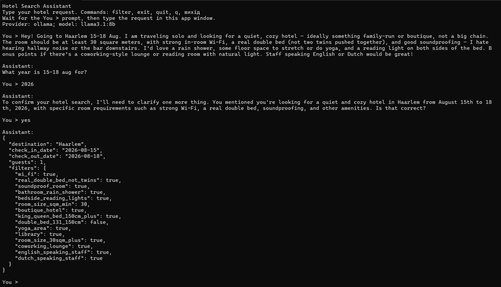
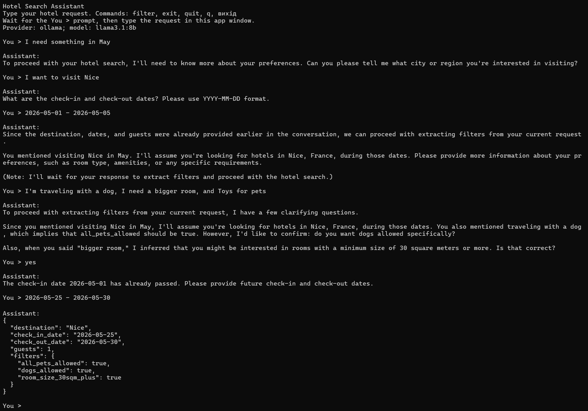
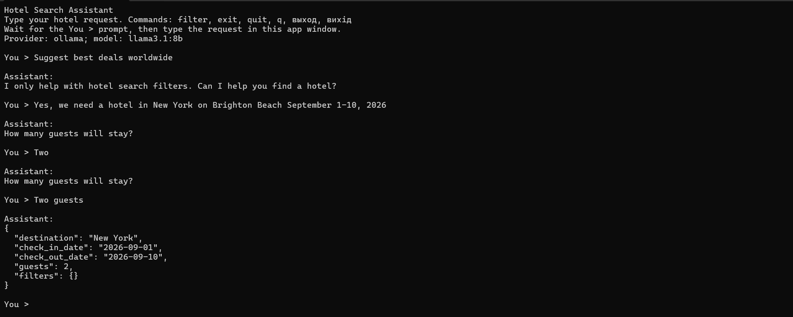
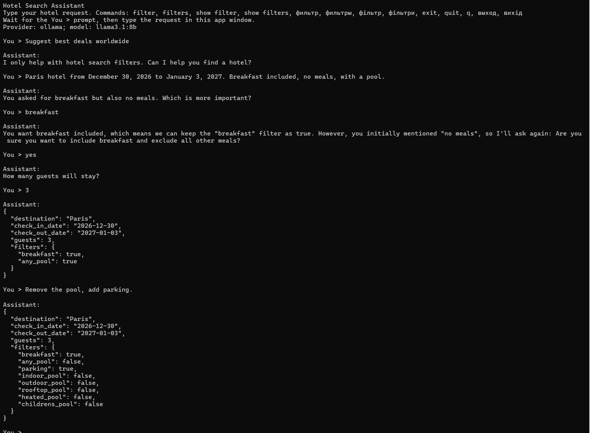

# Hotel Search Assistant

Console Python app that uses an LLM to extract hotel-search filters from natural language.

The app is local-first and uses a free local LLM through [Ollama](https://ollama.com/) by default. It has no Python package dependencies.

## Features

- Reads the system prompt, model and generation parameters from `config/hotel_assistant_config.json`.
- Extracts `destination`, `check_in_date`, `check_out_date`, `guests` and allowed hotel filters.
- Keeps the full conversation context during the interactive session, so commands like `remove breakfast` or short replies like `yes` can update earlier preferences.
- Prints the final hotel search filter payload when you exit the chat.
- Checks extracted stay dates and asks for future dates if the check-in date has already passed.
- Supports Ollama and OpenAI-compatible chat completion endpoints.
- Uses tool/function calling in `--force-json` mode for structured filter extraction.

## Examples of communication









## Quick Start

Install Ollama for Windows from [ollama.com/download/windows](https://ollama.com/download/windows).

After installation, close the current terminal and open a new one. Check that Ollama is available:

```powershell
ollama --version
```

Then pull a free local model:

```powershell
ollama pull llama3.1:8b
```

Create `.venv` and install dependencies:

```powershell
.\scripts\install.bat
```

Run the app from the project root:

```powershell
.\scripts\start.bat
```

Interactive commands:

```text
filter          show the current hotel search filter payload
filters         show the current hotel search filter payload
show filter     show the current hotel search filter payload
show filters    show the current hotel search filter payload
exit            print the final filter payload and close the chat
quit            print the final filter payload and close the chat
q               print the final filter payload and close the chat
```

Interactive messages are separated with labels:

```text
You > Find a hotel in Haarlem for 1 guest

Assistant:
What are your check-in and check-out dates?
```

One-shot request:

```powershell
.\scripts\start.bat --query "Find a hotel in Amsterdam from 2025-08-15 to 2025-08-18 for 2 guests with breakfast, Wi-Fi and parking"
```

Force JSON Schema output when all required data is present:

```powershell
.\scripts\start.bat --force-json --query "Amsterdam, 2025-08-15 to 2025-08-18, 2 guests, breakfast and pool"
```

## Troubleshooting

If you see `Cannot connect to LLM provider at http://localhost:11434/api/chat`, Ollama is not running. Start it in a separate terminal:
`scripts\start.bat` checks `http://localhost:11434` and tries to run `ollama serve` automatically when the configured provider is `ollama`.

You can also start Ollama manually in a separate terminal:

```powershell
ollama serve
```

Then run the app again:

```powershell
.\scripts\start.bat
```

In interactive mode, enter hotel requests only after the app shows the `>` prompt. If you type a request at `c:\...\scripts>` or another Windows command prompt, Windows will treat it as a command.

## Configuration

Main config file: `config/hotel_assistant_config.json`.

`system_prompt` is stored as an array of lines for readability. The app joins those lines with `\n` when loading the config.

Default local/free setup:

```json
{
  "provider": "ollama",
  "base_url": "http://localhost:11434",
  "model": "llama3.1:8b",
  "temperature": 0.2,
  "max_tokens": 500,
  "top_p": 1.0,
  "frequency_penalty": 0,
  "presence_penalty": 0,
  "request_timeout_seconds": 300
}
```

If a local Ollama model is slow on your machine, increase `request_timeout_seconds`, reduce `max_tokens`, or use a smaller model.

The requested OpenAI models are paid, not free. If you still want to use them, change the provider to `openai_compatible`, set `base_url` to `https://api.openai.com`, set `model` to `gpt-4-turbo-preview` or `gpt-3.5-turbo-0125`, and provide `OPENAI_API_KEY` in your environment.

## Notes

The app extracts search filters. It does not include a hotel inventory database, so it cannot calculate a real hotel count by itself. Connect the extracted JSON to your hotel search backend to return actual counts and results.

## License
License: CC BY-NC-SA 4.0

This work is licensed under a Creative Commons Attribution-NonCommercial-ShareAlike 4.0 International License.

You are free to:
✅ Share — copy and redistribute the material in any medium or format
✅ Adapt — remix, transform, and build upon the material
Under the following terms:
Attribution — You must give appropriate credit, provide a link to the license, and indicate if changes were made.
NonCommercial — You may not use the material for commercial purposes.
ShareAlike — If you remix, transform, or build upon the material, you must distribute your contributions under the same license as the original.
Notice:
This project is provided for educational and research purposes only. Commercial use is strictly prohibited without explicit written permission from the author.

---

If you found this project helpful, please consider giving it a ⭐ on GitHub!

